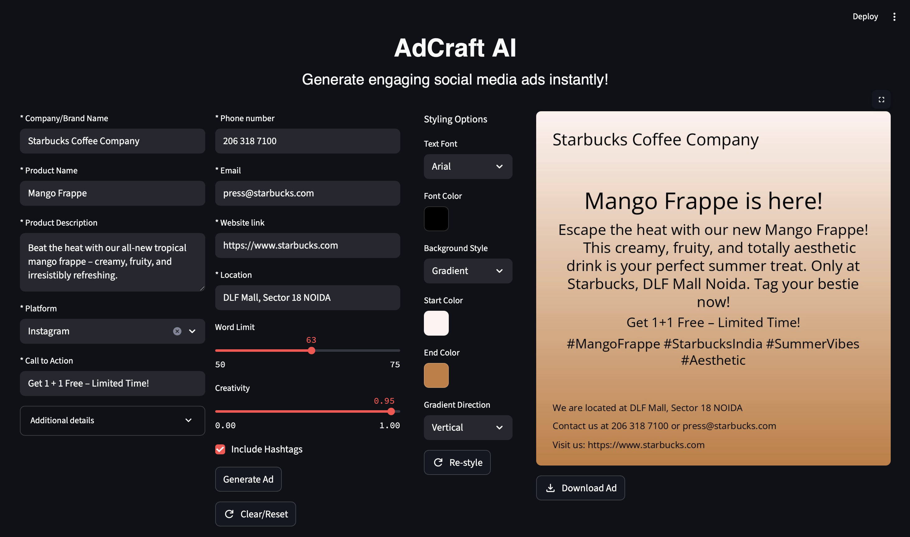

# 🖼️ AdCraft AI

**AdCraft AI** is a Streamlit-powered application that allows users to generate personalized **social media ad postss** with the help of **Google Gemini (via LangChain)** and overlay the generated content onto custom-styled image backgrounds.

---

## ⚡ Try it out

You can either:

- 🔧 **Run locally** using the setup instructions below  
**OR**
- 🌐 **Try the live app here** → [🔗 adcraft-ai.streamlit.app](https://umang23567-adcraft-ai-app-8js2fl.streamlit.app)
> ⚠️ Note: The app is in development. Some features may not work as expected.


---

## ✨ Features

* AI-Powered Ad Generation** using Google Gemini via LangChain
* Customizable Ad Styling** (Fonts, Colors, Gradient/Solid/Image Backgrounds)
* Structured JSON Output** using Pydantic models
* Text Overlay Rendering** for headlines, body, CTA, hashtags, and contact info
* Downloadable Image Ad**
* Session-Aware Interface** with auto-reset on form changes

---

## 📂 Folder Structure

```
adcraft-ai/
│
├── app.py                # Streamlit UI logic
├── ad_chain.py           # LangChain-based ad generation
├── image_gen.py          # Image rendering and text overlay
├── examples.json         # Few-shot examples to guide LLM
├── .env                  # Google Gemini API key (not shared)
├── fonts/                # Font files
│   ├── Anton-Regular.ttf
│   ├── LibreBaskerville-Regular.ttf
│   ├── Montserrat-Italic-VariableFont_wght.ttf
│   ├── OpenSans-VariableFont_wdth,wght.ttf
│   ├── Pacifico-Regular.ttf
└── requirements.txt      # Python dependencies
```

---

## ⚙️ Setup Instructions

### 1. Clone the repository

```bash
git clone https://github.com/umang23567/adcraft-ai.git
cd adcraft-ai
```

### 2. Install Python dependencies

```bash
pip install -r requirements.txt
```

### 3. Set your API key

Create a `.env` file with your Gemini API key:

```
GOOGLE_API_KEY=your_google_gemini_api_key
```

### 4. Run the app

```bash
streamlit run app.py
```

---

## 🧠 Powered By

* [LangChain](https://www.langchain.com/)
* [Google Gemini](https://ai.google.dev/)
* [Streamlit](https://streamlit.io/)
* [Pillow (PIL)](https://pillow.readthedocs.io/)
* [Pydantic](https://docs.pydantic.dev/)

---

## 📷 Example Output

> 

---

## 🛠️ Development Steps

1. **LLM Integration**  
   Used LangChain with Google Gemini and crafted prompts for high-quality ad generation.

2. **JSON Parsing**  
   Parsed structured LLM output using Pydantic models.

3. **Streamlit UI**  
   Built a user-friendly form to collect inputs and styling preferences.

4. **Image Rendering**  
   Generated styled backgrounds and overlayed the ad text using PIL.
---

## 🐛 Known issues

-  **Reset Button Limitation**  
  The "Reset/Clear" button does not fully reset all form fields. Users need to manually refresh the page to start fresh.

-  **Text Formatting Challenges**  
  Due to unpredictable LLM output and variable word limits, precise text positioning and layout control is limited.

-  **Limited Background Suitability**  
  The available solid/gradient/image background options may not be visually optimal for every ad scenario.

- **Minimal Error Handling**  
  Although the code is generally robust, detailed error handling hasn't been implemented.
  In rare cases, unexpected errors or failures (e.g., LLM/API/image issues) may happen.

---


## 🚀 Expansion Ideas

* Support multiple ad variants generation (A/B testing)
* Prompt tuning and refinement to generate more relevant and high-converting ad content.
* Add user accounts and campaign saving features
* Integrate AI image generation using LLM prompts to generate custom ad background images
* Add image templates for different social platforms (Instagram, LinkedIn, etc.)

---

## 👨‍💻 Developed By

**Umang**
Passionate about Generative AI, product design and UI/UX.


